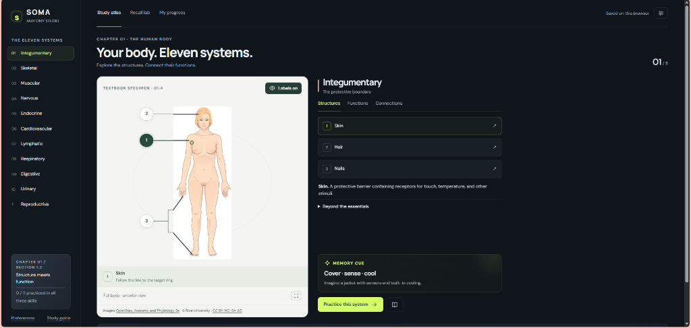
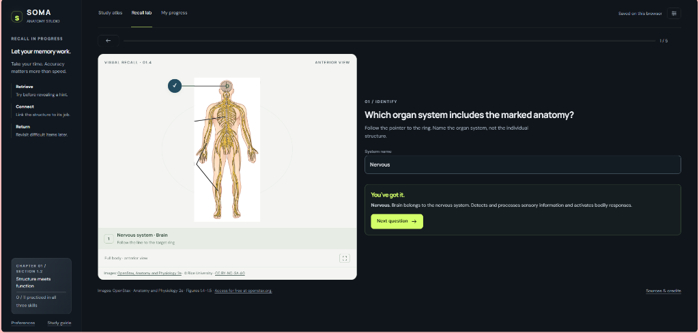

# 🫀 Soma — Anatomy Learning Studio

  
  
  

  <strong>An interactive, distraction-free digital anatomy studio for mastering the eleven human organ systems.</strong> 
  Built with authentic textbook illustrations from <em>OpenStax Anatomy and Physiology 2e</em>, smart active recall, and zero installation required.

---

### 🗺️ Interactive Study Atlas

  
   
  <em>👉 Click the image to explore the interactive 11 organ systems in your browser!</em>

---

### 🧠 Active Recall Lab & Practice

  
   
  <em>👉 Click the image to test your identification, structure-function recall, and clinical connections!</em>

---

## 🌟 Key Features

- **🗺️ Authentic Interactive Atlas:** Explore authentic OpenStax organ figures with interactive pins, enlarged crops, and pinpoint anatomical callouts.
- **🎯 5 Practice Modalities:** Identification, structure-to-function matching, systems comparison, and clinical pathway tracing.
- **💡 Smart Active Recall:** Typing and multiple-choice formats with intelligent spelling tolerance, progressive hints, and targeted retries.
- **🔒 Private & Offline-Ready:** 100% client-side with no logins, tracking, or backend database. Study progress is saved locally in your browser.

---

## 🚀 How to Use

### 🌐 Option 1: Use Online (Instant)
Launch the studio directly in your browser:  
👉 **[https://rorrimaesu.github.io/Soma-Anatomy-Studio/](https://rorrimaesu.github.io/Soma-Anatomy-Studio/)**

### 💻 Option 2: Run Locally (Offline)
- **Windows:** Double-click `Start-Soma-Windows.bat` (opens `http://127.0.0.1:8765`).
- **Mac / Linux:** Run `python3 start_studio.py` in your terminal.

---

## 📚 Attribution & License

- **Source:** *OpenStax Anatomy and Physiology 2e*, Chapter 1 (Section 1.2, Figures 1.4–1.5). © Rice University. Free at [openstax.org](https://openstax.org/details/books/anatomy-and-physiology-2e).
- **License:** Educational adaptations and code are distributed under [CC BY-NC-SA 4.0](https://creativecommons.org/licenses/by-nc-sa/4.0/).

## September 2026 update

- Responsive study workspace with scrolling content panels on desktop and a compact organ-system selector on mobile.
- Clear orange quiz targets and instructions that distinguish structures from organ systems.
- Anatomical target rings aligned to the original printed pointer endpoints.
- Existing browser-local progress and preferences remain compatible.

## Publishing and maintenance

GitHub Pages publishes the `main` branch from the repository root. The root `index.html` redirects to `dist/`, preserving existing app links. There is no build step or separate deployment workflow. Edit the application files in `dist/`, validate locally, and push to `main` to publish.

The `dist/data.js` file contains learning content; `dist/illustrations.js` contains illustration coordinates; `dist/app.js` handles interactions; and `dist/styles.css` controls appearance. Learning records remain in this browser's localStorage and do not synchronize across devices.

Rollback baseline: `pre-studio-update-2026-09-16`. Restore the three application files in `dist/` from that tag, commit them to `main`, and push to trigger a new Pages deployment. Keep branch-based publishing as the single deployment method.

Validation for this release: JavaScript syntax checks; browser navigation through all eleven systems; desktop and 390px mobile layout inspection; reproductive view switching; detail and labels-off controls; typed and multiple-choice grading; assisted-answer accounting; completed-session summary; and progress persistence after reload. No browser errors were observed during these checks.
