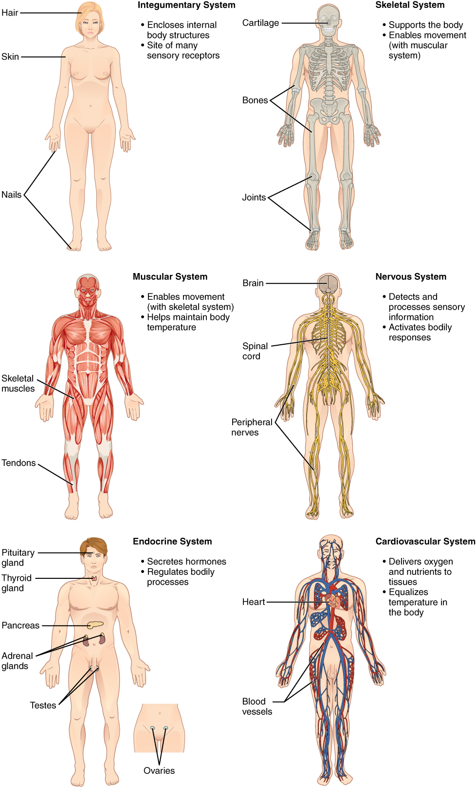

# 🫀 Soma — Anatomy Learning Studio

<p align="center">
  
  <a href="https://rorrimaesu.github.io/Soma-Anatomy-Studio/"></a>
  
  
</p>

<p align="center">
  <strong>An interactive, distraction-free digital anatomy studio for mastering the eleven human organ systems.</strong><br>
  Built with authentic textbook illustrations from <em>OpenStax Anatomy and Physiology 2e</em>, smart active recall, and zero installation required.
</p>

---

<p align="center">
  <a href="https://rorrimaesu.github.io/Soma-Anatomy-Studio/" title="Click to launch Soma Anatomy Studio">
    
  </a>
  <br>
  <br>
  <a href="https://rorrimaesu.github.io/Soma-Anatomy-Studio/">
    
  </a>
  <br>
  <sub><em>✨ Click the illustration or button above to jump straight into the live interactive learning studio!</em></sub>
</p>

---

## 🌟 Highlights & Key Features

<table>
  <tr>
    <td width="50%">
      <h3>🗺️ Authentic Interactive Atlas</h3>
      Explore authentic OpenStax organ figures with high-resolution interactive pins, detailed crops, and side-by-side callouts that follow original anatomical pointers.
    </td>
    <td width="50%">
      <h3>🎯 Active Recall & Quiz Modes</h3>
      Practice across five distinct modalities:
      <ul>
        <li><strong>Identification:</strong> Locate organs on anatomical models</li>
        <li><strong>Structure & Function:</strong> Connect anatomy to physiology</li>
        <li><strong>System Comparison:</strong> Differentiate overlapping roles</li>
        <li><strong>Clinical Pathways:</strong> Trace fluid routes and feedback loops</li>
      </ul>
    </td>
  </tr>
  <tr>
    <td width="50%">
      <h3>💡 Smart Feedback & Hints</h3>
      Typing or multiple-choice formats with intelligent spelling tolerance, progressive hints, and tailored retries to reinforce retention.
    </td>
    <td width="50%">
      <h3>🔒 Private & Instant</h3>
      <strong>100% Client-Side.</strong> No logins, no tracking, no backend database. All study progress is securely retained in your browser's <code>localStorage</code>.
    </td>
  </tr>
</table>

---

## 🗂️ The 11 Organ Systems Covered

Soma organizes Chapter 1.2 into five functional clusters:

| Functional Cluster | Organ Systems | Key Concepts & Organs |
| :--- | :--- | :--- |
| **🛡️ Cover & Movement** | **Integumentary**, **Skeletal**, **Muscular** | Skin barrier, thermoregulation, bone leverage, joint articulation, skeletal muscle contraction |
| **⚡ Communication** | **Nervous**, **Endocrine** | Brain, spinal cord, electrical synapses, hormone signaling, endocrine glands |
| **🚚 Transport & Defense** | **Cardiovascular**, **Lymphatic** | Systemic circulation, blood filtration (spleen), lymph nodes, immune defense |
| **🔄 Exchange & Processing** | **Respiratory**, **Digestive**, **Urinary** | Alveolar gas exchange, mechanical/chemical breakdown, nephron filtration, fluid balance |
| **🌱 Continuity of Life** | **Reproductive** | Male and female gametogenesis, hormone release, developmental support |

---

## 🚀 How to Use

### 🌐 Option 1: Use Online (Recommended)
Simply open the hosted GitHub Pages deployment:  
👉 **[https://rorrimaesu.github.io/Soma-Anatomy-Studio/](https://rorrimaesu.github.io/Soma-Anatomy-Studio/)**

Works seamlessly in any modern desktop, tablet, or mobile web browser.

---

### 💻 Option 2: Run Locally (Offline Mode)

If you wish to run or modify the studio locally without an active internet connection:

#### On Windows:
1. Clone or download this repository:
   ```bash
   git clone https://github.com/RorriMaesu/Soma-Anatomy-Studio.git
   cd Soma-Anatomy-Studio
   ```
2. Double-click **`Start-Soma-Windows.bat`** (or run `python start_studio.py`).
3. Your default web browser will automatically open:
   ```
   http://127.0.0.1:8765
   ```

#### On macOS / Linux:
1. Open a terminal in the project directory:
   ```bash
   python3 start_studio.py
   ```
2. Navigate to `http://127.0.0.1:8765`.

---

## ⚙️ Setting Up GitHub Pages (For Repository Owners)

If you are setting up or re-deploying this repository on GitHub:

1. **Push the repository** to GitHub:
   ```bash
   git remote add origin https://github.com/RorriMaesu/Soma-Anatomy-Studio.git
   git branch -M main
   git push -u origin main
   ```
2. Go to your repository on GitHub: **Settings** ➔ **Pages**.
3. Under **Build and deployment** ➔ **Source**:
   - Choose **GitHub Actions** (recommended — this repo includes an automated `.github/workflows/deploy.yml` workflow).
   - Alternatively, choose **Deploy from a branch** ➔ select branch `main` and root `/`.
4. Your site will be live at:
   ```
   https://rorrimaesu.github.io/Soma-Anatomy-Studio/
   ```

---

## 📚 Attribution & Academic Citation

- **Textbook Source:** *Anatomy and Physiology 2e*, Chapter 1, Section 1.2 (Figures 1.4–1.5), OpenStax.  
- **Copyright:** © 2026 Rice University. Access for free at [openstax.org](https://openstax.org/details/books/anatomy-and-physiology-2e).
- **License:** Educational adaptations and text are licensed under [Creative Commons Attribution-NonCommercial-ShareAlike 4.0 International (CC BY-NC-SA 4.0)](https://creativecommons.org/licenses/by-nc-sa/4.0/).
- Original illustration pixels and pointer vectors are preserved with high fidelity.

---

<p align="center">
  Made with 🤍 for Anatomy & Physiology students everywhere.
</p>
